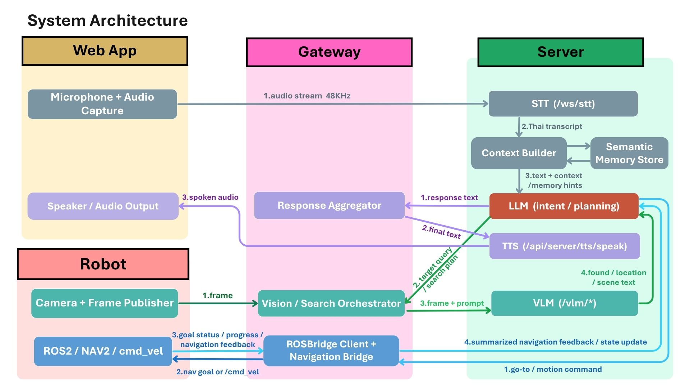
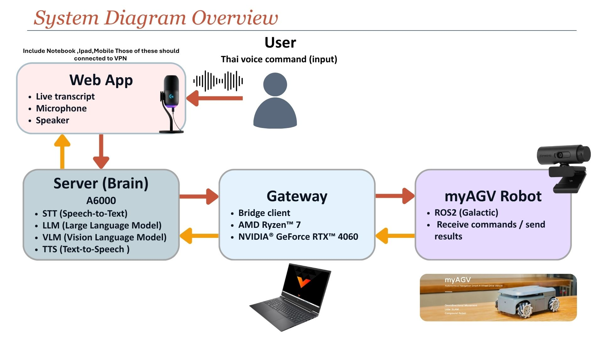
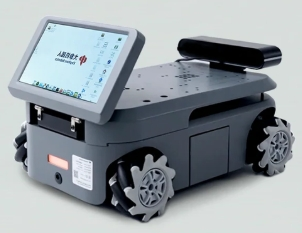
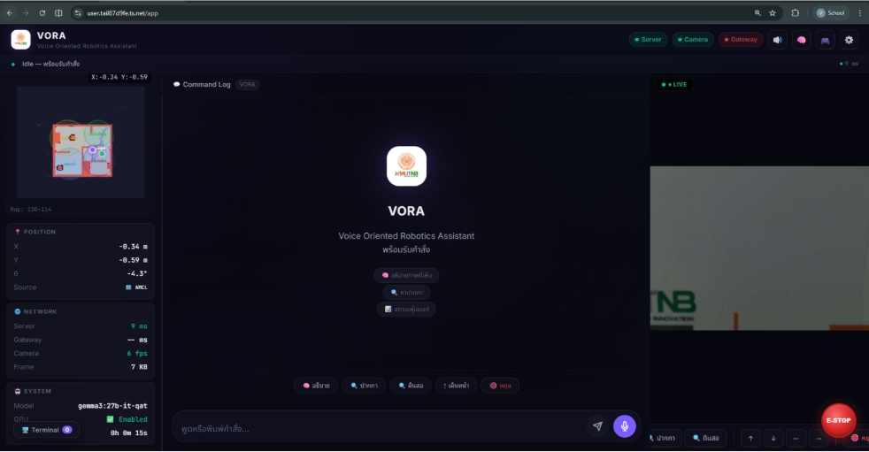
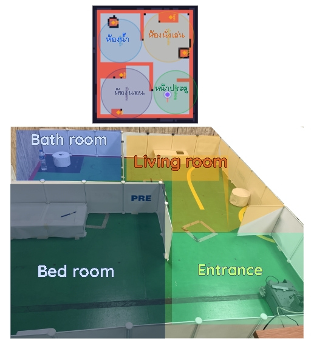

# VORA - Voice Oriented Robotic Assistant

VORA is a production-oriented multimodal AI robotic assistant designed to understand Thai voice commands, reason with Large Language Models (LLMs), analyze visual information using Vision-Language Models (VLMs), and interact with users through a web application and autonomous robot navigation.

This project was developed as a Bachelor's Thesis by a team of 2 students in Robotics and Automation Engineering at King Mongkut's University of Technology North Bangkok.

---

## Demo Video

Watch the project demonstration here:

https://youtu.be/pUpihzj2dnw

---

## Project Overview

VORA is designed to support indoor object-finding tasks in a controlled home-like environment.
The system allows users to interact with the robot using Thai voice commands through a web application. The robot can interpret user intent, navigate to predefined zones, search for target objects, and respond with Thai speech feedback.

The project integrates multiple AI and robotics components into one complete workflow, including:

* Thai Speech-to-Text
* Large Language Model reasoning
* Vision-Language Model visual understanding
* Text-to-Speech response
* FastAPI backend services
* ROS2-based robot navigation
* Real-time web interface

---

## Key Features

* Thai voice command interaction through a web application
* Multimodal AI workflow integrating STT, LLM, VLM, and TTS
* Object-finding capability for indoor environments
* Real-time camera and system status display
* RESTful API and WebSocket communication
* ROS2 and Nav2-based autonomous navigation
* Modular architecture connecting AI services, backend, web application, and robot control

---

## System Architecture

---

## AI Workflow

The core workflow of VORA follows this pipeline:

1. User speaks a Thai voice command through the web application.
2. Speech-to-Text converts audio input into Thai text.
3. The backend processes and normalizes the command.
4. The LLM interprets user intent and generates an action plan.
5. The system sends commands to the robot navigation module.
6. The Vision-Language Model analyzes camera frames for object search tasks.
7. The robot provides feedback through Thai Text-to-Speech and web status updates.

---

## Robot Platform

The system was deployed on a myAGV robotic platform with ROS2-based navigation.
The robot uses LiDAR, camera input, and predefined map zones to support indoor navigation and object-search behavior.

---

## Web Application

The web application provides:

* Voice input interface
* Live speech transcription
* Robot status display
* Camera frame display
* System feedback messages

---

## Map and Navigation

The robot operates in a controlled indoor environment with predefined zones.
Navigation is handled using ROS2, Nav2, and map-based localization.

---

## Tech Stack

### Artificial Intelligence

* Large Language Models (LLMs)
* Vision-Language Models (VLMs)
* Speech-to-Text
* Text-to-Speech
* Prompt Engineering
* Multimodal AI Workflow

### Backend and Integration

* Python
* FastAPI
* RESTful APIs
* WebSocket
* Modular backend services

### Robotics

* ROS2
* Nav2
* SLAM Toolbox
* AMCL
* LiDAR-based navigation
* myAGV robot platform

### Tools and Environment

* Git
* Docker
* Linux Ubuntu
* Conda environment
* Real-time camera streaming

---

## My Contributions

As part of a two-person thesis team, my main contributions included:

* Designed and implemented the multimodal AI workflow integrating Speech-to-Text, LLMs, VLMs, and Text-to-Speech.
* Developed backend services and RESTful APIs using Python and FastAPI.
* Integrated AI services with the web application and robotic navigation system.
* Supported real-time system communication between the AI server, gateway, and robot platform.
* Evaluated AI performance using speech recognition accuracy and response quality metrics.
* Collaborated on system testing, debugging, and final project integration.

---

## Evaluation Summary

The system was evaluated across multiple components:

* Thai voice command understanding
* LLM-based task planning
* Vision-Language Model object finding
* End-to-end robot task execution
* Text-to-Speech feedback

The evaluation focused on system correctness, AI response reliability, and real-world usability in a controlled indoor environment.

---

## Note

This repository is intended to present the project architecture, implementation overview, and demonstration for portfolio and educational purposes. Some environment-specific configuration files, credentials, runtime logs, and local deployment files are excluded for security and maintainability.
